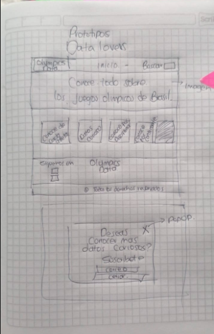
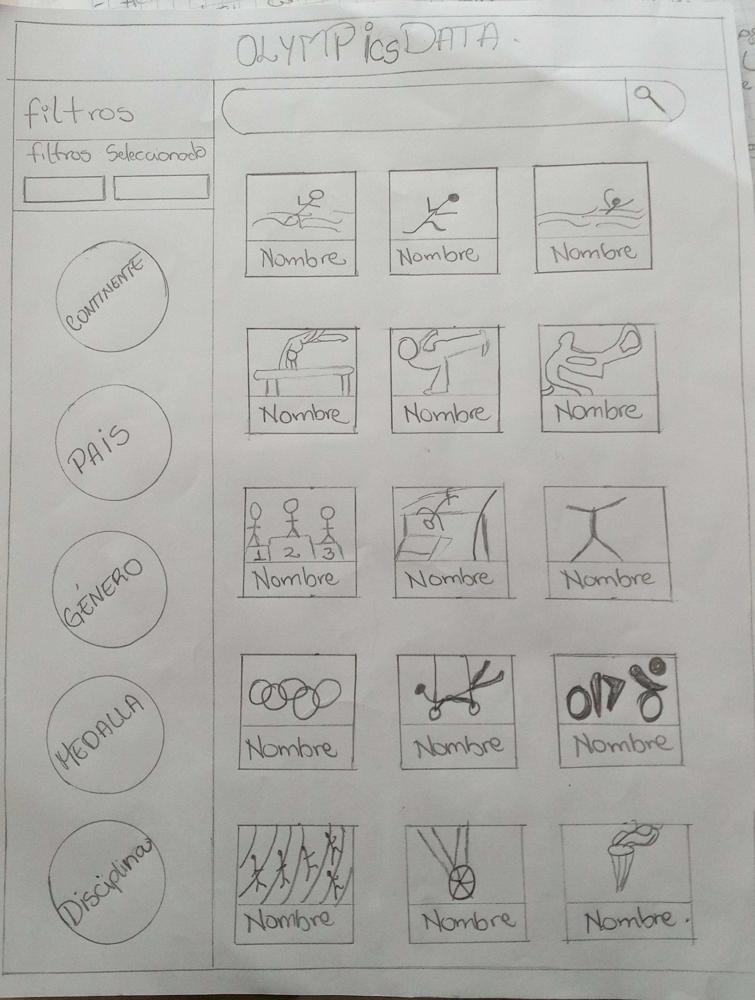
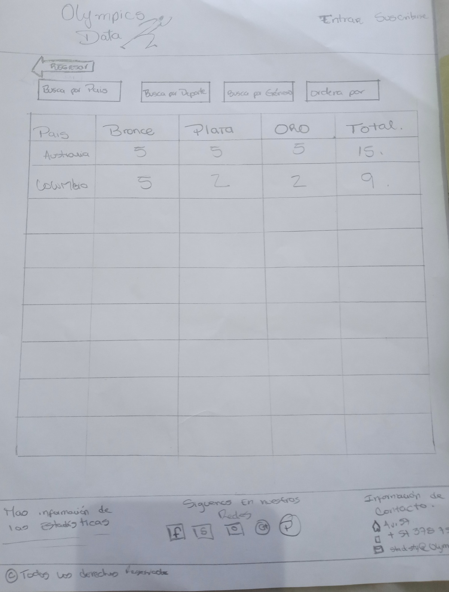
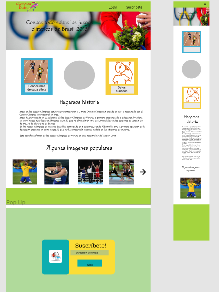
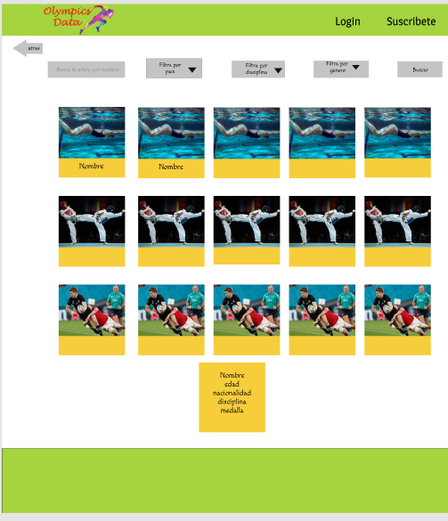
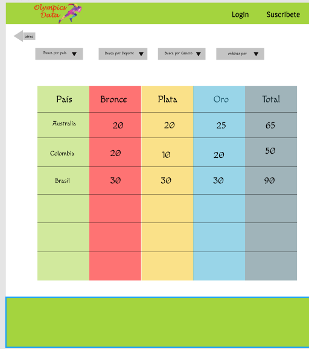

# BOG002-data-lovers

# Data Lovers - Olympics Data

## Índice

* [1. Preámbulo](#1-preámbulo)
* [2. Resumen del proyecto](#2-resumen-del-proyecto)
* [3. Definición del producto](#3-definición-del-producto)
* [4. Historias de usarios](#4-historias-usuarios)
* [5. Diseño de la interfaz de Usuario](#5-diseño-de-la-interfaz-de-usuario)
* [6. Objetivos de aprendizajes](#6-objetivo-de-aprendizaje)
* [7. Checklist](#7-checklist)

## 1. Preámbulo

Este proyecto es el desarrollo de una página web que nos permitirá visualizar una serie de datos olímpicos de Rio 2016, pensando en la información que puede llegar a ser relevante para cada usuario que quiera conocer más acerca de los atletas que compitieron durante esa temporada. 

## 2. Resumen del proyecto

Olympics Data es un proyecto pensado en mostrar los datos relevantes de cada atleta durante los juegos olimpicos de Rio 2016. Ha sido un proyecto desarrollado en dupla y cuya duración ha sido de 5 sprint (5 semanas).
Durante este tiempo se trabajó minuciosamente la planificación y se llevó a cabo una serie de historias de usuario, especificando la experiencia de cada usuario al navegar en la interfaz, para ellos se diseñó pensando en la cómodidad del usuario, se realizaron los test de usabilidad para poder llegar a la meta propuesta, a través de prototipos de baja y alta fidelidad.

## 3. Definicion del Producto
Olympics Data es una web diseñada para usuarios que muestran interés en estadísticas y datos reevantes acerca de los atletas de las olimpiadas celebradas en Rio de Janeiro 2016.

Cuenta con dos secciones importantes:
1. Conoce mas de los atletas: en donde se puede visualizar la imagen de cada atleta, su nombre, deporte, equipo, medalla, edad y género.
2. Medallero: una sección donde se puede visualizar cada una de las medallas, diferenciando por su tipo (oro,plata y bronce), así como la totalidad de medallas por países.

Adicionalmente hay una sección en la página principal en la cual se puede conocer un poco más acerca de la historia  de los juegos olimpicos en Rio 2016, así como una serie de imágenes relevantes de esta temporada de las olimpiadas en América Latina.

## 4. Historias de Usuarios.

* Historia #1: 
El Usuario interesado en conocer acerca de los ultimos juegos olimpicos Brasil 2016, ingresa a nuestra pagina web donde puede seleccionar por categoria lo que le interesa conocer acerca de los juegos.
Categorias desplegadas:
- Conoce más de los atletas
- Medallero
Asi mismo cuenta con una reseña historica acerca de los juegos olimpicos en Rio de janeiro y las victorias mas impotantes de este pais en distintos juegos, asi mismo cuenta con un carrusel con las imagenes mas destacadas de Rio 2016.

Adicionalmente, justo cuando el usuario tenga 2 minutos de visita en la pagina se desplegara un pop up para invitarlo a suscribirse en nuestra pagina.

Yo como _usuario_ **quiero** ver una página con información acerca de los juegos olimpicos Rio 2016, **para** conocer datos básicos (información de los atletas, historia de los juegos olimpicos durante está temporada, ver imágenes populares y tener la opción de suscribirme).

### Criterios de Aceptación
- Hay un interfaz de presentación de la tematica deportiva.
- Hay una intefaz con diferentes opciones de búsqueda de acuerdo a la categoría preferida.
- Hay una breve historia para conecer mas acerca del pais anfitrion.
- Hay un carrusel con imagenes destacadas en rio 2016.
- Hay una opcion de suscripcion.
- Hay links para visitar nuestras redes sociales.

### Definicion de Terminado 
- El usuario se encuentra con una interfaz responsive.
- Se pasan los test usabilidad.

* Historia #2:
Nuestro usuario tiene la opción de seleccionar el primer filtro (Conoce mas por atleta)
El usuario a traves de un click abre una nueva pantalla donde se despliega la siguiente información:
-Foto, nombre, deporte, equipo, edad, medalla y género
-Se filtraran por nombre
-Se filtraran por deporte
-Se filtraran por país
- Se filtraran por género
Yo como _usuario_ **quiero** ver una página con información acerca de los atletas, **para** conocer datos básicos acerca de ellos ( nombre, género, deporte, medallas, país y edad), así como la posibilidad de poder filtrarlos pos deporte, país, género y nombre del atleta.

### Criterios de Aceptación
- Hay una interfaz que muestra a los distintos atletas (Foto, nombre, edad, pais y medalla)

### Definicion de Terminado
- Intefaz responsive.
- El usuario tiene distintas maneras de filtrar los datos relevantes de los atletas.

* Historia #3:
Nuestro usuario tiene la opción de seleccionar el primer filtro (Conoce mas por atleta)
El usuario a través de un click abre una nueva pantalla donde se despliega la siguiente información:
- Una foto alusiva a los juegos olímpicos
- Esa misma tarjeta con la foto al colocar el mouse sobre la tarjeta se abrirá y encontrará información acerca de los atletas (nombre, equipo, medalla, sexo, edad).
Yo como _usuario_ **quiero** ver una página con fotos de todos los atletas ganadores de medallas durante la temporada de Rio 2016 de los juegos olimpicos, **para** conocer datos básicos acerca de ellos( nombre, género, deporte, medallas, país y edad)

### Criterios de Aceptación
- Hay una sección para mostrar información importante acerca de los atletas.

### Definicion de Terminado
- La página es responsive.
- Se logra ver la información de los atletas.

* Historia #4:
El usuario desea a través de filtros buscar por nombre, país, género y deporte.
El usuario desea ver el numero de medallas por país.

Yo como _usuario_ **quiero** buscar a los atletas por nombre, país, género y deporte, así como conocer los tipos de medallas que cada país ha ganado **para** poder estar informado acerca de los países que son mas ganadores de medallas.

### Criterios de Aceptación
- Se tienen 4 filtros (Nombre, país, genero, deporte).
- Se despliegan país, genero y deporte de los select.
- En el filtro nombre se ingresa el nombre del atleta o letra relacionada y se muestran las coincidencias.
- Se le permite al usuario volver a la pagina principal.
- el usuario puede acceder a la opción medallero para conocer las medallas por país.
- En una tabla aparecen totalizadas las medallas por país.
- Se le permite al usuario volver del medallero a las pagina principal.
### Definicion de Terminado
- La pagina es responsive.
- Los filtros se aplican correctamente.
- Los botones permiten regresar a la pagina principal.
- Aparecen totalizadas el numero de medallas por país.
- El cada tarjeta se visualiza la información de cada atleta (Equipo, nombre, genero, país, disciplina).

## 5. Diseño de la interfaz de Usuario
Para la planificación de a interfaz se procedió a realizar un prototipo de baja y de alta fidelidad.

### Prototipo de Baja Fidelidad

Se muestran prototipos de baja fidelidad, con el cual se realizaron pruebas de usabilidad y al recibir el feedback de los mismos, se mejoraron los bocetos para corregir todos esos errores.
* Primera Iteración:

* Segunda Iteración:

### Prototipo de Alta Fidelidad
A continuacion los prototipos de alta fidelidad realizados con la herramienta **Figma** donde se aplicaron los principios de diseño visual para nuestra propuesta final.

## 6. Objetivos de aprendizaje

El objetivo principal de este proyecto es aprender a diseñar y construir una interfaz web donde se pueda visualizar y manipular data, entendiendo lo que el usuario necesita.

### HTML y CSS

* [X] [Uso de HTML semántico.](https://developer.mozilla.org/en-US/docs/Glossary/Semantics#Semantics_in_HTML)
* [X] Uso de selectores de CSS.
* [X] Construir tu aplicación respetando el diseño realizado (maquetación).
* [X] [Uso de flexbox en CSS.](https://css-tricks.com/snippets/css/a-guide-to-flexbox/)

### DOM y Web APIs

* [X] Uso de selectores del DOM.
* [X] Manejo de eventos del DOM.
* [X] [Manipulación dinámica del DOM.](https://developer.mozilla.org/es/docs/Referencia_DOM_de_Gecko/Introducci%C3%B3n)
(appendChild |createElement | createTextNode| innerHTML | textContent | etc.)

### JavaScript

* [X] Uso de condicionales (if-else | switch | operador ternario)
* [X] Uso de bucles (for | for..in | for..of | while)
* [X] Uso de funciones (parámetros | argumentos | valor de retorno)
* [X] Manipular arrays (filter | map | sort | reduce)
* [X] Manipular objects (key | value)
* [X] Uso ES modules ([`import`]|[`export`]
* [X] Diferenciar entre expression y statements.
* [X] Diferenciar entre tipos de datos primitivos y no primitivos.

### Testing

* [X] [Testeo unitario.]

### Estructura del código y guía de estilo

* [X] Organizar y dividir el código en módulos (Modularización)
* [X] Uso de identificadores descriptivos (Nomenclatura | Semántica)
* [X] Uso de linter (ESLINT)

### Git y GitHub

* [X] Uso de comandos de git (add | commit | pull | status | push)
* [X] Manejo de repositorios de GitHub (clone | fork | gh-pages)
* [ ] Colaboración en Github (branches | pull requests | |tags)

### UX

* [X] Diseñar la aplicación pensando y entendiendo al usuario.
* [X] Crear prototipos para obtener feedback e iterar.
* [X] Aplicar los principios de diseño visual (contraste, alineación, jerarquía)
* [X] Planear y ejecutar tests de usabilidad.

## 7. Checklist

* [X] Usa VanillaJS.
* [X] No hace uso de `this`.
* [X] Pasa linter (`npm run pretest`)
* [X] Pasa tests (`npm test`)
* [X] Pruebas unitarias cubren un mínimo del 70% de statements, functions y
  lines y branches.
* [X] Incluye _Definición del producto_ clara e informativa en `README.md`.
* [X] Incluye historias de usuario en `README.md`.
* [X] Incluye _sketch_ de la solución (prototipo de baja fidelidad) en
  `README.md`.
* [X] Incluye _Diseño de la Interfaz de Usuario_ (prototipo de alta fidelidad)
  en `README.md`.
* [X] Incluye link a Zeplin en `README.md`.
* [X] Incluye el listado de problemas que detectaste a través de tests de
  usabilidad en el `README.md`.
* [X] UI: Muestra lista y/o tabla con datos y/o indicadores.
* [] UI: Permite ordenar data por uno o más campos (asc y desc).
* [X] UI: Permite filtrar data en base a una condición.
* [X] UI: Es _responsive_.

### Pruebas unitarias

El _boilerplate_ de este proyecto no incluye Pruebas Unitarias (_tests_), así es
que  tendrás que escribirlas tú para las funciones encargadas de  _procesar_,
_filtrar_ y _ordenar_ la data, así como _calcular_ estadísticas.

Tus _pruebas unitarias_ deben dar una cobertura del 70% de _statements_
(_sentencias_), _functions_ (_funciones_), _lines_ (_líneas_), y _branches_
(_ramas_) del archivo `src/data.js` que contenga tus funciones y está detallado
en la sección de [Consideraciones técnicas](#srcdatajs).
